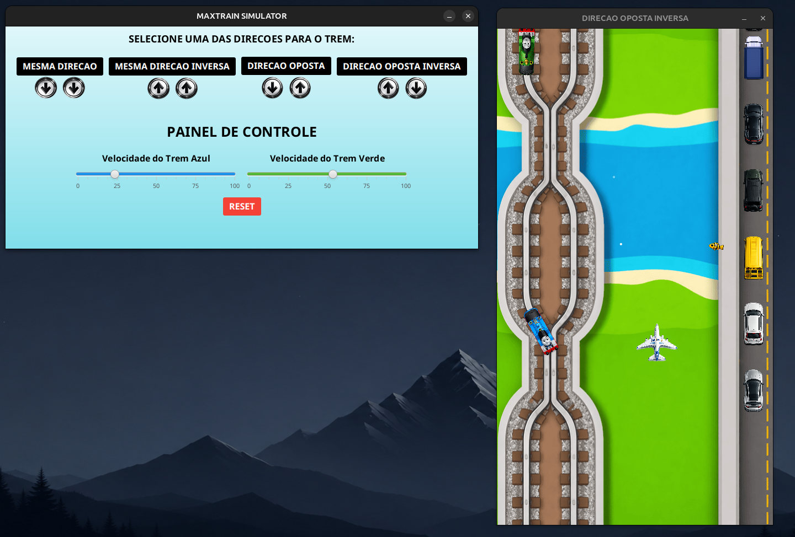
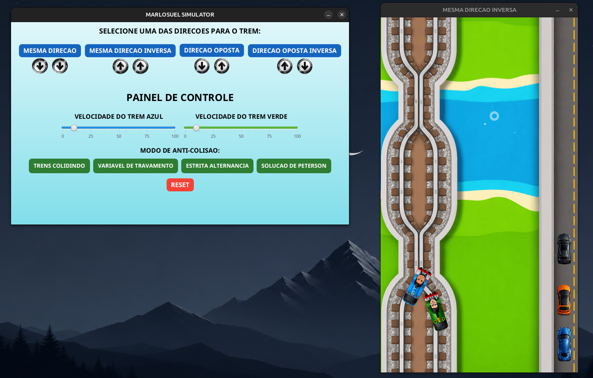
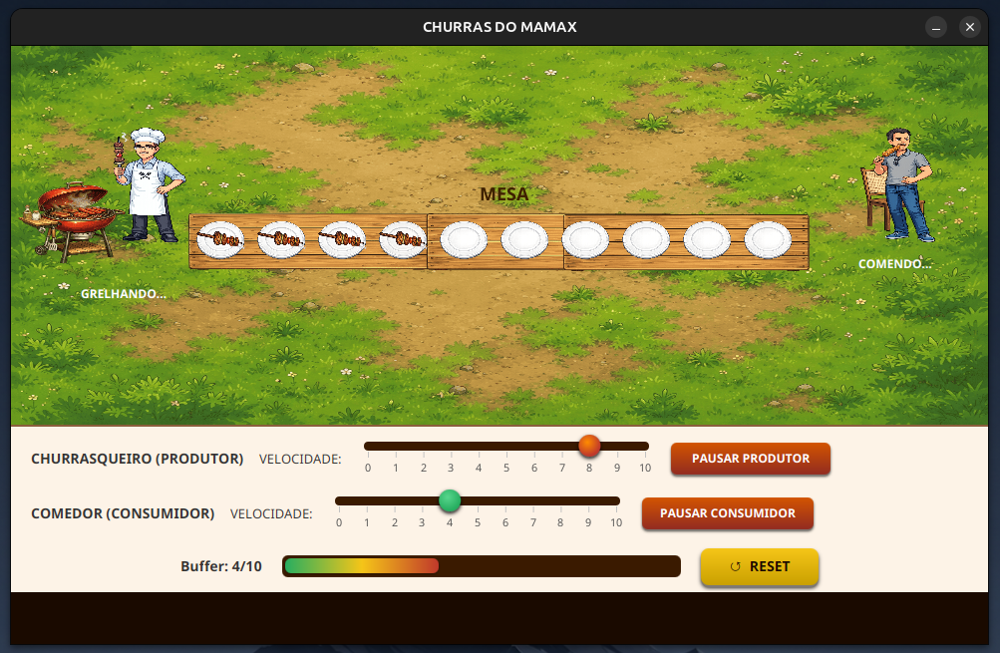
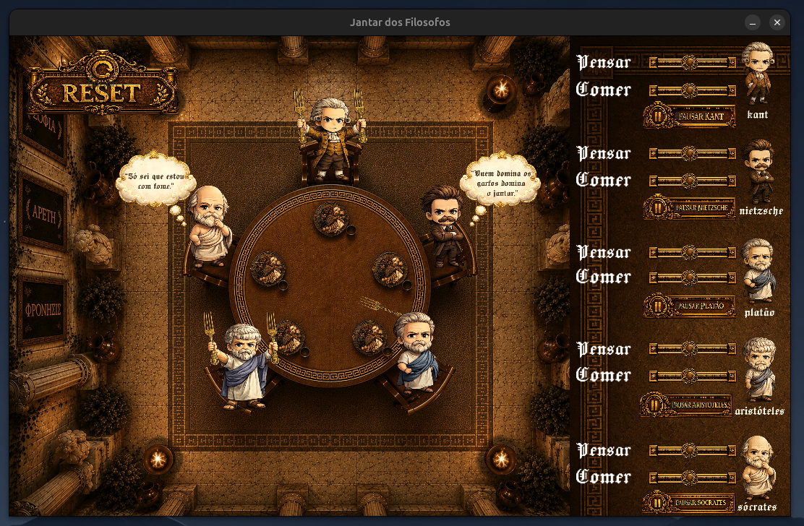
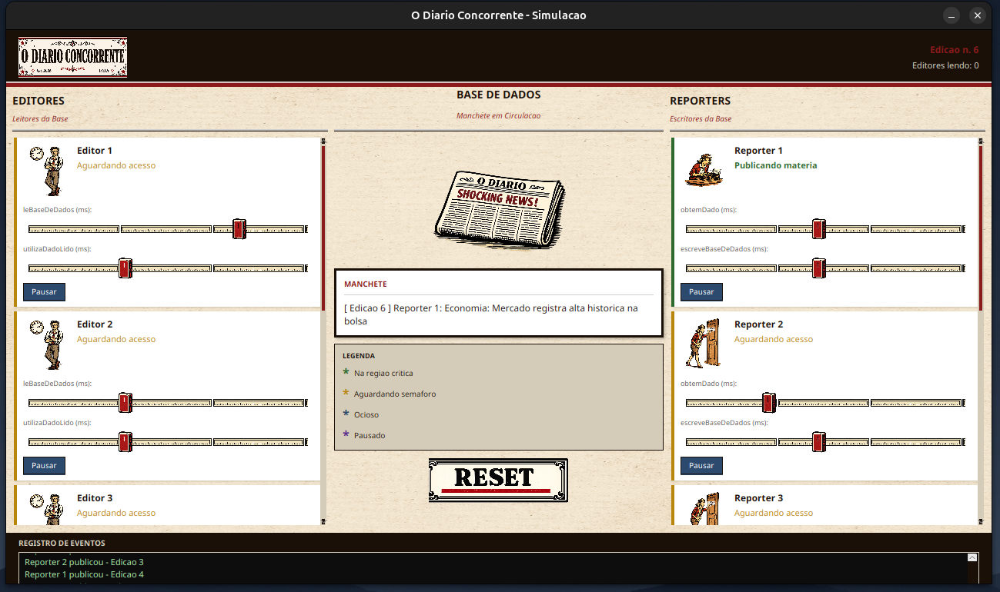
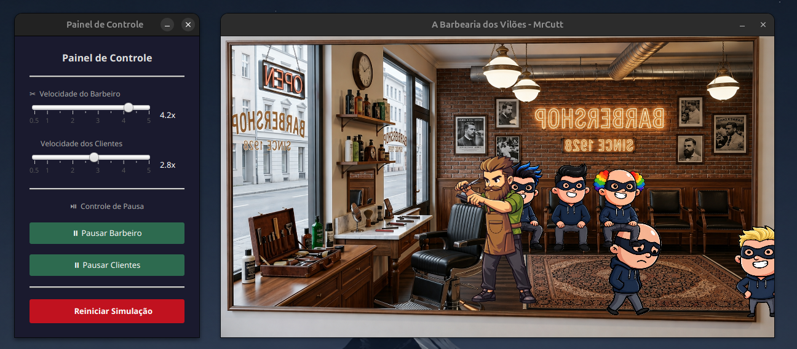
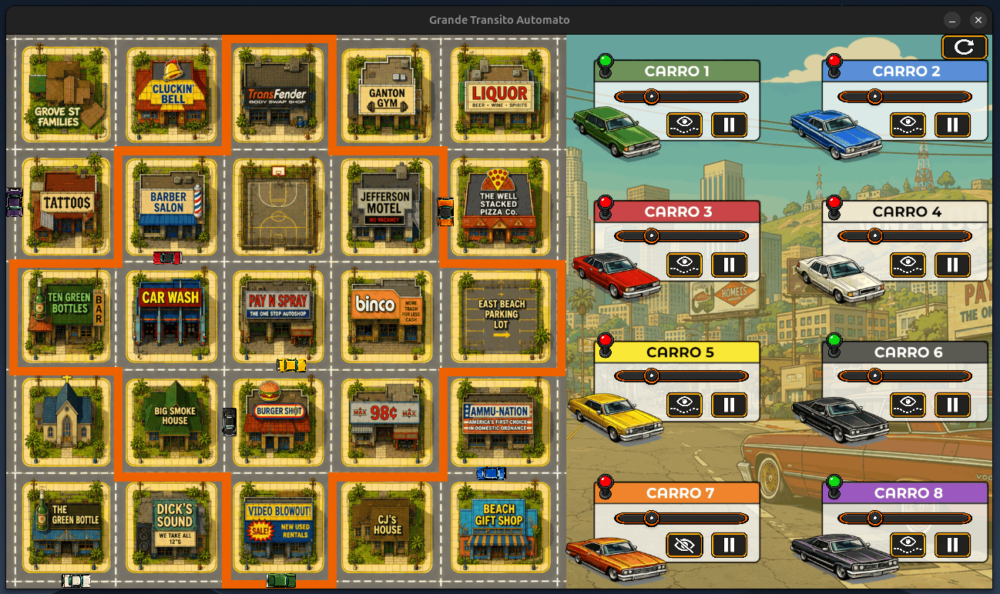

# Programação Concorrente

Repositório com projetos desenvolvidos na disciplina de **Programação Concorrente**, utilizando **Java**, **JavaFX**, threads e mecanismos de sincronização para representar problemas clássicos da área.

## Projetos

### 1. Trens sem Threads

Simulação visual de dois trens percorrendo trilhos compartilhados, com controle de direção e velocidade. Esta versão serve como base para observar o comportamento da animação antes da aplicação de técnicas de concorrência.

<p align="center"></p>

### 2. Trens com Threads

Cada trem é executado por uma thread independente. O acesso aos trechos críticos é controlado por **variável de travamento**, **estrita alternância** ou **solução de Peterson**, evitando colisões nos trilhos compartilhados.

<p align="center"></p>

### 3. Produtor e Consumidor

Representa um produtor que insere itens em um buffer circular e um consumidor que os remove. Os semáforos `mutex`, `empty` e `full` controlam a exclusão mútua e impedem consumo com o buffer vazio ou produção com o buffer cheio.

<p align="center"></p>

### 4. Jantar dos Filósofos

Cinco filósofos alternam entre pensar, esperar e comer, compartilhando garfos com seus vizinhos. Semáforos e estados individuais garantem que filósofos adjacentes não utilizem os mesmos garfos simultaneamente.

<p align="center"></p>

### 5. Leitores e Escritores

Simula leitores acessando uma base de dados simultaneamente e escritores realizando acesso exclusivo. Semáforos coordenam as operações para impedir leitura durante uma escrita e a atuação simultânea de escritores.

<p align="center"></p>

### 6. Barbeiro Dorminhoco

Simula uma barbearia com quantidade limitada de cadeiras. O barbeiro dorme quando não há clientes, acorda quando alguém chega e atende a fila, enquanto clientes desistem quando não existem vagas disponíveis.

<p align="center"></p>

### 7. Trânsito Autômato

Simula vários carros executados por threads em percursos que possuem trechos e cruzamentos compartilhados. Semáforos e reservas de regiões críticas coordenam o tráfego, evitando colisões e bloqueios entre os veículos.

<p align="center"></p>

## Execução

Com **Java** e **JavaFX** configurados, acesse a pasta do projeto desejado e execute:

```bash
javac Principal.java
java Principal
```

## Disciplina

Projetos da disciplina **Programação Concorrente — 2026.1**, ministrada pelo professor **Marlos André Marques Simões de Oliveira**.